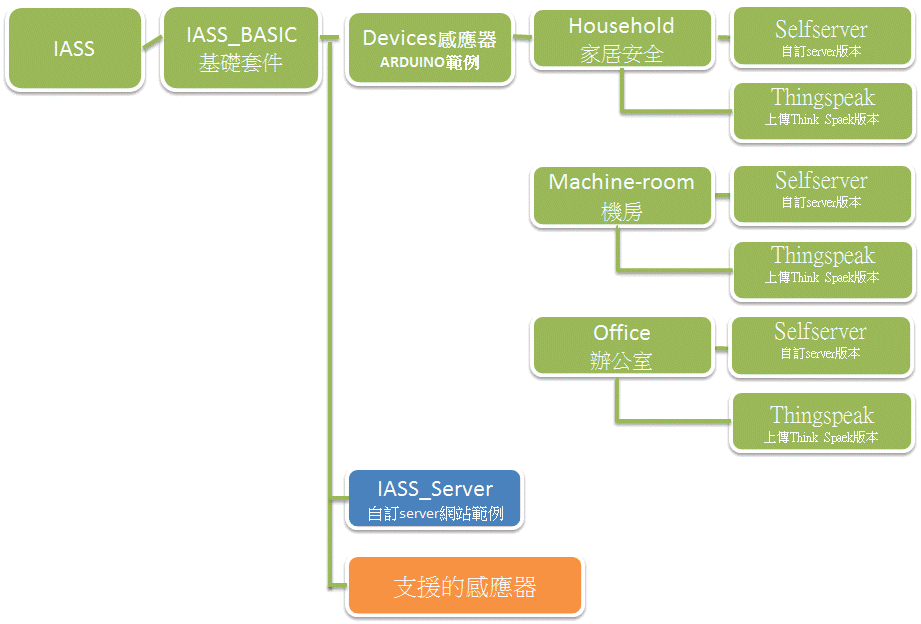

A)[IASS的特色](https://chtseng.wordpress.com/2016/03/31/iass%e7%89%b9%e8%89%b2/)

B)使用IASS的三種樣本，開始準備材料及組裝

&nbsp;&nbsp;B.1)選擇您需要的感測裝置類型 
&nbsp;&nbsp;&nbsp;&nbsp;- [辦公室專用感測裝置](https://chtseng.wordpress.com/2016/03/31/diy-%e8%be%a6%e5%85%ac%e5%ae%a4%e7%9a%84%e6%84%9f%e6%b8%ac%e8%a3%9d%e7%bd%ae/)			
&nbsp;&nbsp;&nbsp;&nbsp;- [居家安全專用感測裝置](https://chtseng.wordpress.com/2016/03/31/%e5%b1%85%e5%ae%b6%e5%ae%89%e5%85%a8%e5%b0%88%e7%94%a8%e6%84%9f%e6%b8%ac%e5%99%a8diy/) 
&nbsp;&nbsp;&nbsp;&nbsp;- [機房專用感測裝置](https://chtseng.wordpress.com/2016/03/31/%e6%a9%9f%e6%88%bf%e5%b0%88%e7%94%a8%e6%84%9f%e6%b8%ac%e5%99%a8diy-2/) 
		
&nbsp;&nbsp;B.2)[是否加裝LCD螢幕](https://chtseng.wordpress.com/2016/04/14/%E6%9B%BFiass%E5%8A%A0%E4%B8%8Alcd%E8%9E%A2%E5%B9%95/)
		
&nbsp;&nbsp;B.3)選擇要使用直接上傳ThingSpeak還是自建主機版本的Arduino程式
			
&nbsp;&nbsp;B.4)[Arduino程式燒錄](https://chtseng.wordpress.com/2016/03/31/%E7%A8%8B%E5%BC%8F%E7%87%92%E9%8C%84%E5%8F%8A%E5%A0%B1%E8%A1%A8%E8%A8%AD%E5%AE%9A/)	
	
&nbsp;&nbsp;B.5)若您選擇上傳ThingSpeak版本：	
&nbsp;&nbsp;&nbsp;&nbsp;- [ThingSpeak報表設定](https://chtseng.wordpress.com/2016/04/14/thingspeak-%E5%A0%B1%E8%A1%A8%E8%A8%AD%E5%AE%9A/)
	
&nbsp;&nbsp;B.6)若您選擇自建主機版本： 
&nbsp;&nbsp;&nbsp;&nbsp;- [安裝及設定IASS主機] (https://chtseng.wordpress.com/2016/04/13/%e8%87%aa%e8%a1%8c%e6%9e%b6%e8%a8%adiass%e4%b8%bb%e6%a9%9f-2/)
  

